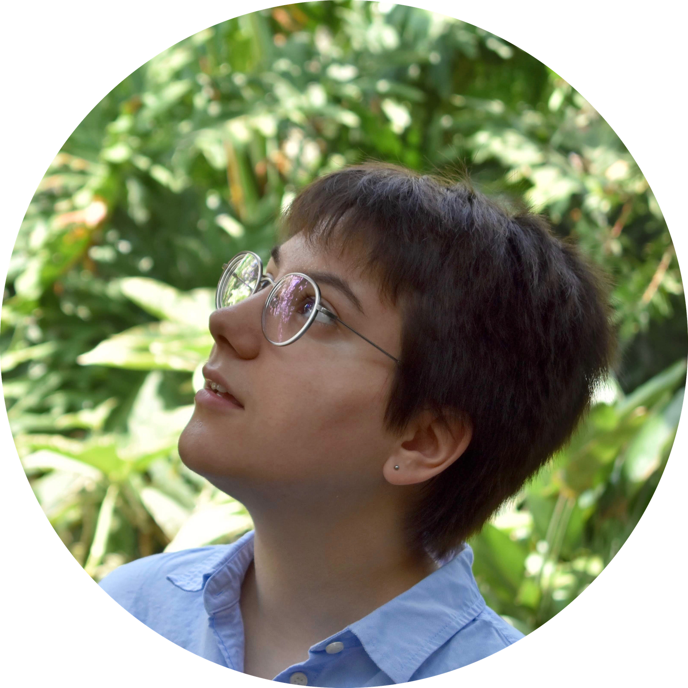

---
# Feel free to add content and custom Front Matter to this file.
# To modify the layout, see https://jekyllrb.com/docs/themes/#overriding-theme-defaults

layout: home
---

## Hello!

> My name is Alyssa Bulatek and I am a senior at Macalester College in St. Paul, Minnesota. I have been lucky enough to have had several really cool research opportunities during my undergraduate career so far; please see [my CV](https://abulatek.github.io/resources/abulatek_cv.pdf) for more information about these.

### Interests

**Research:** I am currently most interested in pushing the boundaries of observational astronomy to higher and higher angular resolutions. My current research interests are primarily related to circumstellar disks and radio frequency instrumentation development.

**Rocketry:** I am an active member of [Macalester's High Power Rocketry team](https://abulatek.github.io/rocketry/), and I have participated in the design and build processes of several competition rockets: Quantum Field Theory I, Quantum Heavy, and Mach-alester I. Our team is participating in the Spaceport America Cup in 2020.

**Technical theatre and more:** I also harbor a love for theatre and work in the costume shop at Macalester. My favorite musical is [*Big Fish*](https://www.theatricalrights.com/show/big-fish/). I am an [avid player](https://www.youtube.com/channel/UCYdvdoHbrFpmEM9TXPnenIA) of the [Nancy Drew PC game series](https://www.herinteractive.com/shop-games/all-games/).

### Recent Activities

- **January 2020:** Poster, *235th Meeting of the American Astronomical Society*
  - I presented my work from Green Bank at the 235th Meeting of the American Astronomical Society in Honolulu, Hawaii.

- **May to August 2019:** Summer Student, *Green Bank Observatory*
  - In a remote town in West Virginia, I worked on a new ultra-wideband radio receiver for the Green Bank Telescope, the largest moveable structure made by humans. The GBT has a collecting area almost as large as two football fields! The receiver will be used to time pulsars, stars which are really precise clocks, with greater accuracy than ever before.

- **January 2019:** Poster, *233rd Meeting of the American Astronomical Society*
  - I presented my work from the REU at the University of Rochester at the 233rd Meeting of the AAS in Seattle, Washington.

- **November 2018:** Undergraduate Research Post, *Astrobites*
  - A blurb I wrote about my summer research at the University of Rochester was featured by Astrobites, an online journal written by graduate students across the world that strives to increase the reach of current research in astronomy by translating published research into a digestible format geared towards the undergraduate student reader.
    - Post: ["Signal-Dependent IPC in HgCdTe Detector Arrays for NEOCam"](https://astrobites.org/2018/11/05/ur-interpixel-capacitance/)
