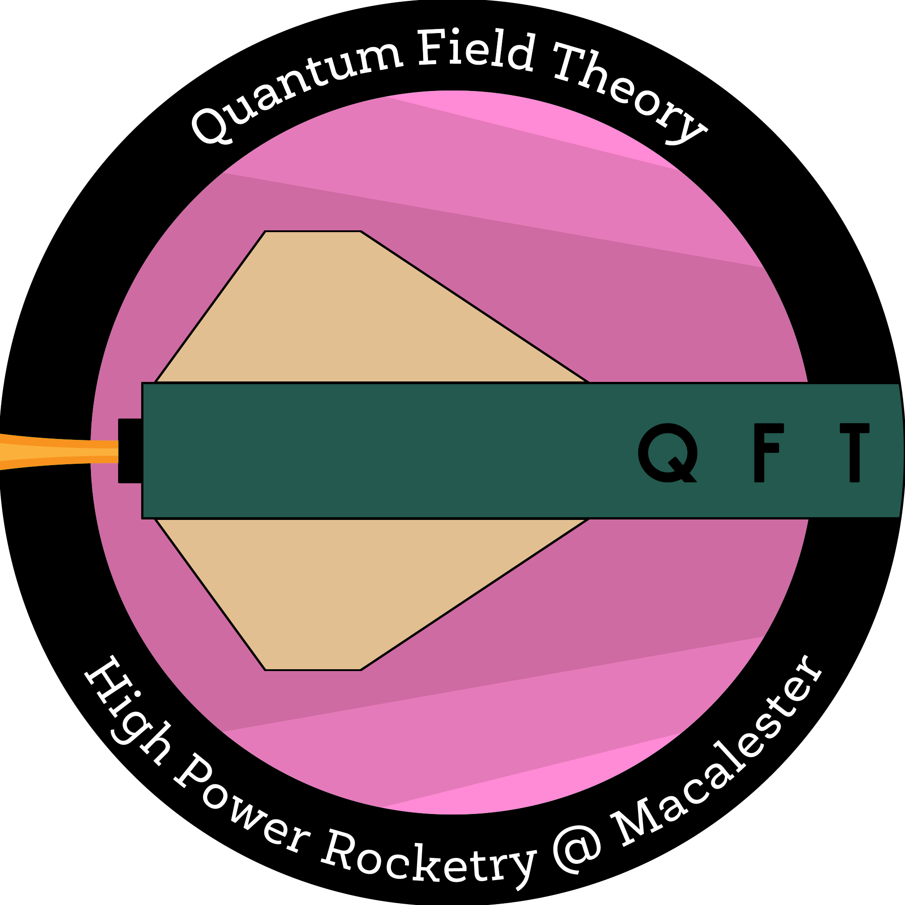
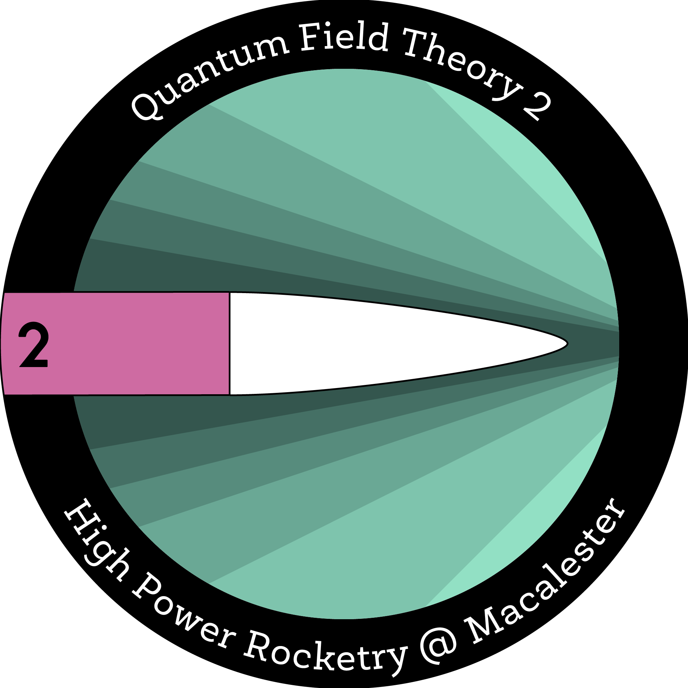
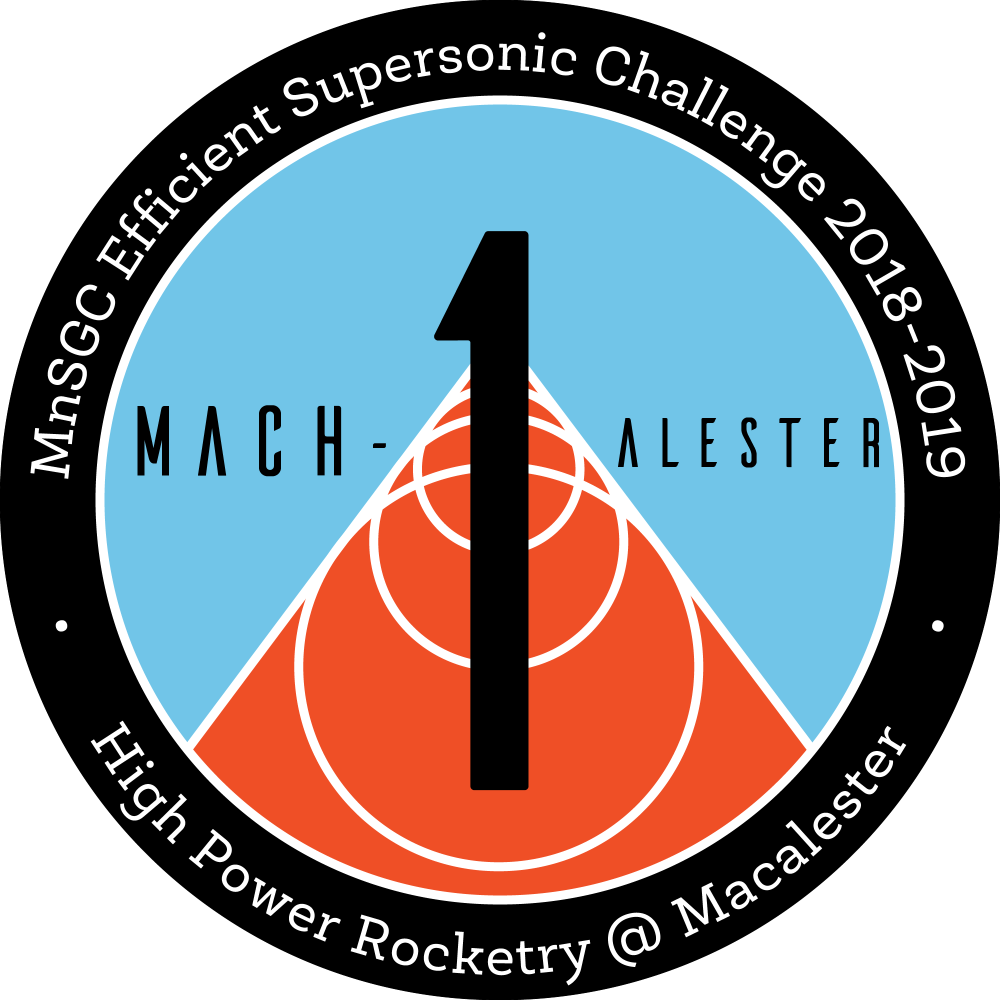
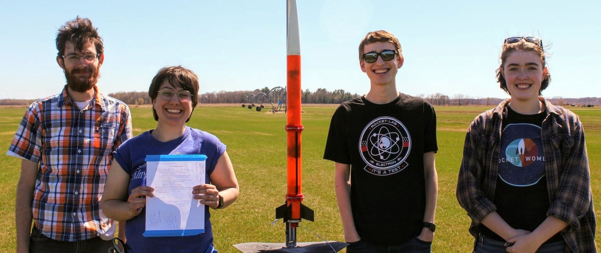
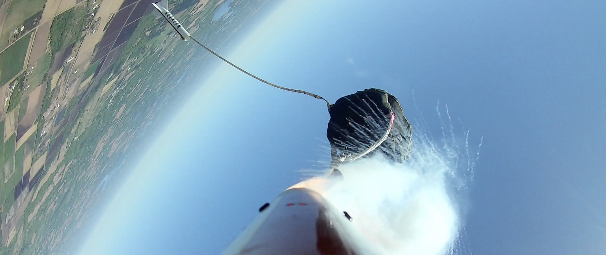

## High Power Rocketry at Macalester

> [Click here to see the rocketry-related projects I've been involved with!](https://abulatek.github.io/rocketry_projects.html)

I am a co-founder of Macalester College's high power rocketry team, founded in 2017. We build and fly rockets for annual competitions throughout the academic year.

I was recently elected **president** of High Power Rocketry at Macalester for the 2019-2020 school year. I am excited to take on this role. I am committed to making the team as welcoming of an environment as possible and making the ideas and opinions of my fellow team members heard. Previously, I have served as **treasurer** of the team. As treasurer, I compiled monthly expense reporting and kept an updated budgetary spreadsheet. I also served on the leadership council and informed executive decisions. I learned a lot about the wonders of conditional formatting during my tenure as treasurer.

  
  
  

These mission patches were designed by I. Langdon, artist and rocketry extraordinaire.

### Education and Public Outreach

The rocketry team engages in **educational and public outreach (EPO) activities** at least once per semester. We host "build your own rocket" sessions in the Idea Lab, the maker space in Macalester's library. These events are open to the general public as well as the Macalester student body. For the past few semesters, I have lead the EPO efforts in the Idea Lab for the team. I have purchased and gathered materials for the events and helped facilitate the rocket launches.

  Photo coming soon!

### Spaceport America Cup 2020

High Power Rocketry at Macalester intends to participate in the IREC Spaceport America Cup in the spring of 2020. The SA Cup is a competition where students of all education levels from across the world gather in the New Mexico desert to launch rockets between 4 and 8 inches in diameter and up to 20 feet in length. This will be a whole new ballgame for the team, but we are so excited to take on the challenge.

### Mach-alester I

Our team participated in the NASA Space Grant Midwest High Power Rocketry Competition during the 2018-2019 school year, our second entry into the competition. The challenge of this competition was to build an **"efficient supersonic"** rocket---break the speed of sound during flight, but fly to the lowest possible maximum altitude. Our rocket, dubbed Mach-alester I, weighed in at less than 4.5 pounds with motors installed and stood only 3 feet tall. We have had one test launch, but have not yet launched for the competition due to muddy launch fields. Watch this space in October 2019 for an update on how the launch went!

  

### Quantum Field Theory II

Hands-on experience is an important step in the early careers of scientists who build and launch rockets for competitions. To help new team members get experience, we built an **"experience rocket"** called Quantum Field Theory II. It was based off of a kit, and built in tandem with two students who were attempting Level 1 certification through the Tripoli Rocketry Association with similar rockets of their own. QFT II was painted neon pink and is one of the cutest rockets I have helped build.

  Photo coming soon!

### Quantum Heavy

Quantum Heavy was built for our first entry in the Midwest High Power Rocketry Competition in 2018. It was quite heavy indeed at over 6.5 pounds. The goal of the 2017-2018 competition was to build a rocket that could **control its rotation** about its roll axis. We chose to do this using a flywheel powered by a stepper motor. There were several new techniques employed by the team for this build, including a spring system to deploy LEDs outside of the rocket that would display which direction the flywheel was spinning. Due to a gyroscope with a low sampling rate, QH was unable to successfully control its roll, but building the rocket and participating in the competition was a rewarding experience nonetheless.

  

### Quantum Field Theory I

During the fall of 2017, a professor at Macalester asked some students in the physics department if we would be interested in building a rocket along with other colleges in Minnesota using **video lessons** given by the University of Minnesota. Our interest lead us to build Quantum Field Theory I, whose name was inspired by a textbook in our workspace and the fact that our coach is a theoretical physicist.

  Photo coming soon!

